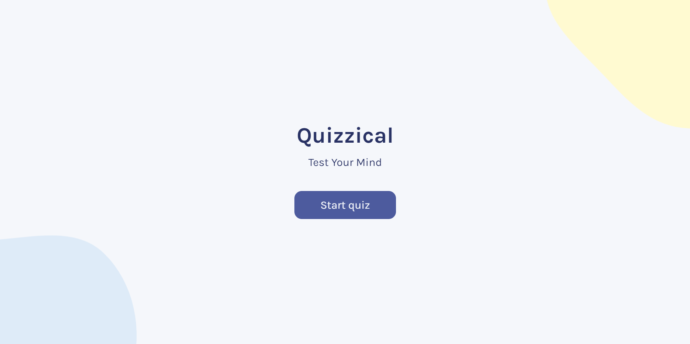
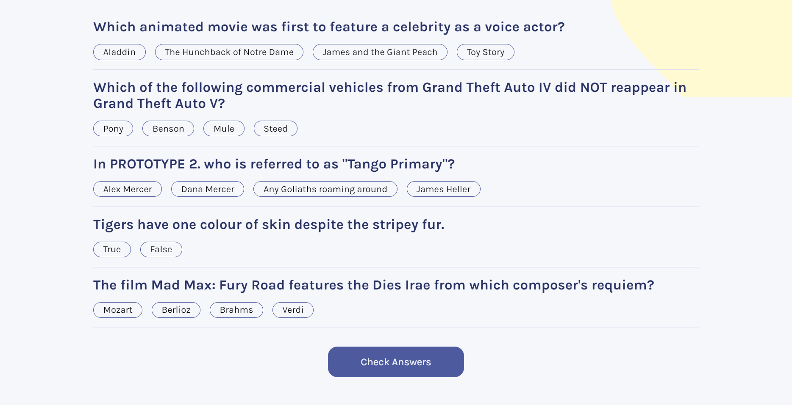
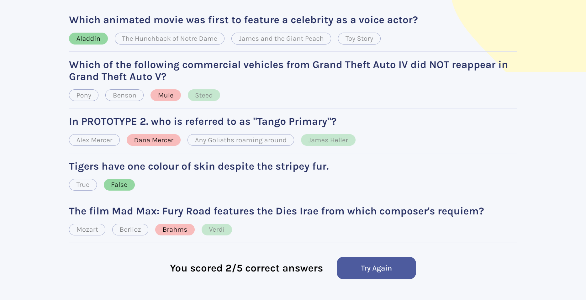

# Quizzical : Quiz Game

## Table of contents

- [Overview](#overview)
  - [The challenge](#Features)
  - [Screenshot](#screenshot)
  - [Links](#links)
- [My process](#my-process)
  - [Built with](#built-with)
- [Author](#author)

## Overview

### Features

Users should be able to:

- View the optimal layout for the app depending on their device's screen size
- See hover states for all interactive elements on the page
- Get new questions everytime they open the game or press play again
- Choose between different answers
- Check wether his answeres correct or wrong
- Get the score for how many questions he got correct
- Restart the fame when pressing play again 

### Screenshot

### Links

- Live Site URL: [live site](https://msabdalaal.github.io/Quizzical)

## My process

### Built with

- Semantic HTML5 markup
- CSS custom properties
- Flexbox
- CSS Grid
- Mobile-first workflow
- React JS
- JavaScript

## Author

- Frontend Mentor - [@msabdalaal](https://www.frontendmentor.io/profile/msabdalaal)
- facebook - [@msabdalaal](https://www.facebook.com/msabdalaal)
